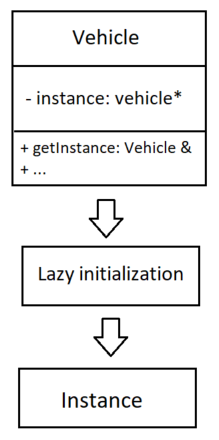
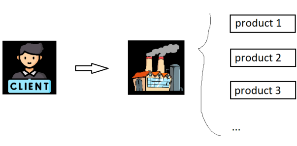

# 1. Singleton Method Design Pattern

## Giới thiệu

- **Singleton pattern** là 1 design pattern đảm bảo chỉ có 1 instance của class được tạo ra trong toàn bộ chương trình. Nếu cứ tạo ra instance mới thì nó sẽ return về cái instance _đầu tiên_ được tạo.
- Ngoài ra, Singleton còn cung cấp 1 điểm truy cập toàn cục (global point of access) tới _instance_.

## Ví dụ

**Source**

```c++
#include <iostream>
#include "string"

class Vehicle {
   private:
    Vehicle() {
        std::cout << "Vehicle instance created (constructor)." << std::endl;
    }
    ~Vehicle() {
        std::cout << "Vehicle instance destroyed (destructor)." << std::endl;
    }

   public:
    static Vehicle& getInstance() {
        if (!instance) {
            std::cout << "step 1" << std::endl;
            instance = new Vehicle();
        }
        return *instance;
    }
    void doSomething() {
        std::cout << "Vehicle is doing sth..." << std::endl;
    }
    // (3)
    Vehicle(const Vehicle&) = delete;
    Vehicle& operator=(const Vehicle&) = delete;

    static Vehicle* instance;
};

// Initialize the static instance variable to nullptr
Vehicle* Vehicle::instance = nullptr;

int main() {
    Vehicle& obj_vehicle = Vehicle::getInstance();
    obj_vehicle.doSomething();

    return 0;
}

```

**Giải thích**

- Trong class _Vehicle_ có constructor và destructor được khai báo trong private vì thế được tạo hay hủy hàm chỉ được thực hiện trong chính class này.
- Hàm _getInstance_ được khởi tạo ở dạng _static_ cung cấp quyền truy cập vào instance duy nhất trong _Vehicle class_. Nó sử dụng **lazy initialization**, tức là nó sẽ tạo ra _instance_ khi _getInstance_ được gọi lần đầu tiên, các lần gọi tiếp theo sẽ trả về _instance_ đã có.
- Clear _copy constructor_ và gán operator (3) để ngăn chặn instance trong _vehicle_ được nhân bản, đảm bảo chỉ có 1 instance.

**Lưu đồ**

<p align="center">
  
</p>

# 2. Factory Method Design Pattern

## Giới thiệu

- Factory method là 1 pp liên quan tới việc tạo object mà không cần chỉ định chính xác class của obj được khởi tạo.
- Factory method hữu ích khi cần tách rời việc khởi tạo và thực thi.
  

## Ví dụ

**Source**

```c++
// A design without factory pattern
#include <iostream>

#include "string"
using namespace std;

// Library classes
class Vehicle {
   public:
    virtual void printVehicle() = 0;
};
class Motorbike : public Vehicle {
   public:
    void printVehicle() {
        cout << "Using motorbike" << endl;
    }
};
class Car : public Vehicle {
   public:
    void printVehicle() {
        cout << "Using car" << endl;
    }
};

// Client (or user) class
class Client {
   public:
    Client(string typeVehicle) {
        if (typeVehicle == "Motorbike")
            pVehicle = new Motorbike();
        else if (typeVehicle == "Car")
            pVehicle = new Car();
        else
            pVehicle = NULL;
    }

    ~Client() {
        cout << "check outside destructor" << endl;
        if (pVehicle) {
            cout << "check inside destructor" << endl;
            delete pVehicle;
            pVehicle = NULL;
        }
    }

    Vehicle* getVehicle() { return pVehicle; }

   private:
    Vehicle* pVehicle;
};

// Driver program
int main() {
    Client* pClient = new Client("Car");
    Vehicle* pVehicle = pClient->getVehicle();
    pVehicle->printVehicle();
    return 0;
}

```

<!-- End -->

<span style="color: blue;">Cảm ơn các bạn đã đọc bài viết, tài liệu được mình tổng hợp khi tự học, có gì còn thiếu sót hãy thông cảm cho mình nha. Good bye, see yaaa !</span>

<p align="center">
  
</p>

# Tài liệu tham khảo

1. [Singleton Design Pattern](https://www.youtube.com/watch?v=hUE_j6q0LTQ&list=PLrhzvIcii6GNjpARdnO4ueTUAVR9eMBpc&index=6)
